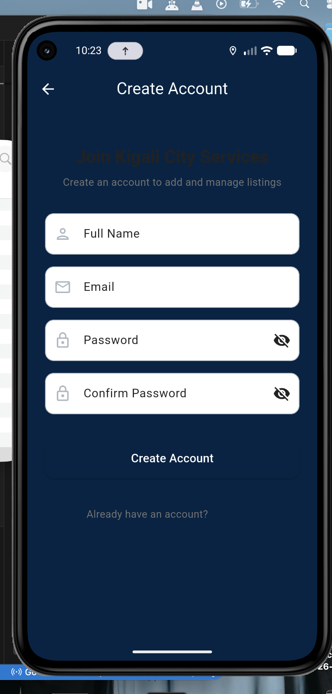

# Kigali City Services & Places Directory

A Flutter mobile application to help Kigali residents locate and navigate to essential public services and leisure locations such as hospitals, police stations, libraries, restaurants, cafés, parks, and tourist attractions.

## Features

### Authentication
- User registration with email and password (Firebase Auth)
- Email verification required before accessing the app
- Secure login and logout functionality
- User profiles stored in Firestore

### Location Listings (CRUD)
- Create new service/place listings with:
  - Name, Category, Address, Contact Number
  - Description, Geographic Coordinates
  - Automatic timestamp and user association
- View all listings in a shared directory
- Edit/delete your own listings
- Real-time updates via Firestore streams

### Search & Filtering
- Search listings by name
- Filter by category (Hospital, Police Station, Library, Restaurant, Café, Park, Tourist Attraction, Utility Office)
- Dynamic results that update in real-time

### Map Integration
- Interactive Google Maps with all listings displayed
- Category-based marker colors
- Embedded maps on detail pages
- Turn-by-turn navigation to any location via Google Maps

### Navigation
- Bottom navigation bar with 4 screens:
  - **Directory**: Browse all listings
  - **My Listings**: Manage your own listings
  - **Map View**: See all locations on a map
  - **Settings**: Profile info and notification preferences

## Tech Stack

- **Flutter** - Cross-platform mobile framework
- **Firebase Authentication** - User authentication
- **Cloud Firestore** - Real-time database
- **Riverpod** - State management
- **Google Maps Flutter** - Map integration
- **Geolocator** - Location services

## Project Structure

```
lib/
├── main.dart                    # App entry point with auth wrapper
├── firebase_options.dart        # Firebase configuration
├── models/
│   ├── user_model.dart          # User data model
│   └── listing_model.dart       # Listing data model with categories
├── services/
│   ├── auth_service.dart        # Firebase Auth operations
│   └── listing_service.dart     # Firestore CRUD operations
├── providers/
│   ├── auth_provider.dart       # Auth state management
│   └── listing_provider.dart    # Listings state management
├── screens/
│   ├── auth/
│   │   ├── login_screen.dart
│   │   ├── signup_screen.dart
│   │   └── email_verification_screen.dart
│   ├── home/
│   │   ├── directory_screen.dart
│   │   ├── my_listings_screen.dart
│   │   ├── map_view_screen.dart
│   │   └── settings_screen.dart
│   ├── listing/
│   │   ├── listing_detail_screen.dart
│   │   └── add_edit_listing_screen.dart
│   └── home_shell.dart          # Main navigation wrapper
└── widgets/
    ├── listing_card.dart
    └── category_filter_chip.dart
```

## Firestore Database Structure

### Collections

#### `users`
```json
{
  "uid": "user_id",
  "email": "user@example.com",
  "displayName": "User Name",
  "emailVerified": true,
  "createdAt": "timestamp",
  "notificationsEnabled": true
}
```

#### `listings`
```json
{
  "name": "King Faisal Hospital",
  "category": "hospital",
  "address": "KG 544 St, Kigali",
  "contactNumber": "+250 788 123 456",
  "description": "A major hospital in Kigali...",
  "latitude": -1.9403,
  "longitude": 29.8739,
  "createdBy": "user_uid",
  "timestamp": "timestamp"
}
```

## State Management

This app uses **Riverpod** for state management:

- `authStateProvider` - Listens to Firebase auth state changes
- `authNotifierProvider` - Handles auth operations (sign up, sign in, sign out)
- `listingsStreamProvider` - Real-time stream of all listings
- `userListingsStreamProvider` - Stream of user's own listings
- `filteredListingsProvider` - Computed provider for search/filter
- `listingNotifierProvider` - Handles CRUD operations

### Data Flow
1. Services layer interacts with Firebase (no direct Firebase calls in UI)
2. Providers expose streams/futures from services
3. UI widgets consume providers and rebuild automatically on changes
4. All loading/error states handled via AsyncValue

## Setup Instructions

### Prerequisites
- Flutter SDK (3.0+)
- Firebase account
- Google Cloud Platform account (for Maps API)

### Firebase Setup

1. Create a new Firebase project at [Firebase Console](https://console.firebase.google.com/)

2. Enable Authentication:
   - Go to Authentication > Sign-in method
   - Enable Email/Password provider

3. Create Firestore Database:
   - Go to Firestore Database > Create database
   - Start in test mode or configure security rules

4. Install FlutterFire CLI:
   ```bash
   dart pub global activate flutterfire_cli
   ```

5. Configure Firebase:
   ```bash
   flutterfire configure
   ```
   This will generate `firebase_options.dart` with your credentials.

### Google Maps Setup

1. Go to [Google Cloud Console](https://console.cloud.google.com/)
2. Enable Maps SDK for Android and Maps SDK for iOS
3. Create an API key with Maps SDK restrictions
4. Add your API key:
   - **Android**: `android/app/src/main/AndroidManifest.xml`
   - **iOS**: `ios/Runner/AppDelegate.swift`

### Run the App

```bash
# Get dependencies
flutter pub get

# Run on emulator/device
flutter run
```

## Firestore Security Rules

```javascript
rules_version = '2';
service cloud.firestore {
  match /databases/{database}/documents {
    // Users collection
    match /users/{userId} {
      allow read: if request.auth != null;
      allow write: if request.auth != null && request.auth.uid == userId;
    }
    
    // Listings collection
    match /listings/{listingId} {
      allow read: if request.auth != null;
      allow create: if request.auth != null;
      allow update, delete: if request.auth != null && 
        request.auth.uid == resource.data.createdBy;
    }
  }
}
```

## Screenshots



(Add screenshots of your app here)

## License


Github repo:https: //github.com/Hannah1563/Kigalicity-Services-.git
Demo video: https: //youtu.be/jWopDNakx_c?si=ovLKQzN-yAbgwNRw
Document link:https://docs.google.com/document/d/1ISdW8zGwArqa6yDfHfHXubHGwKyn3KQDvBwR8BnMN_E/edit?usp=sharing

**Submission Date:** March 9, 2026  
**Author:** Hannah ISHIMWETuyishimire  
**Course:** Mobile Application Development
